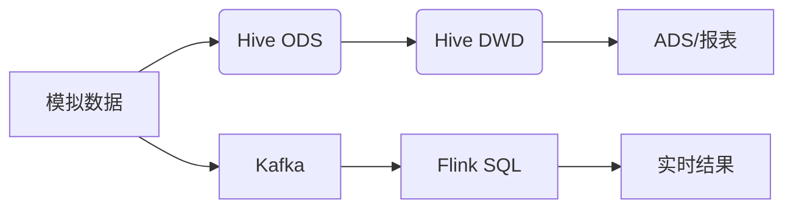

# 电商用户行为分析平台（离线数仓 + 实时流处理尝试）


## 项目简介

模拟电商用户行为数据（点击、加购、收藏、购买），构建 **Hive 离线数仓**（ODS → DWD → ADS），分析核心运营指标（PV/UV、转化率、留存率、热门商品等）。同时尝试搭建 **Kafka + Flink** 实时流处理链路（因环境配置问题未完全跑通，但已完成数据生产与 Flink SQL 作业设计）。

## 系统架构


技术栈
类别	技术	版本/说明
容器化	Docker Compose	V2
数据仓库	Apache Hive	4.0.0
元数据存储	MySQL	8.0
消息队列	Apache Kafka	2.8 (wurstmeister)
协调服务	ZooKeeper	latest
实时计算	Apache Flink	1.18.1
缓存	Redis	7-alpine
数据生成/生产	Python	3.8+
快速开始
环境要求
Docker Desktop (WSL2 backend)

Python 3.8+（用于运行数据生成脚本）

1. 启动所有服务
```bash
docker compose up -d
```
2. 生成测试数据
```bash
python scripts/generate_data.py          # 生成 UserBehavior.csv
docker cp UserBehavior.csv hive-server:/tmp/
```
3. 运行离线分析
```bash
# 进入 Hive Beeline
docker exec -it hive-server /opt/hive/bin/beeline -u jdbc:hive2://localhost:10000

# 依次执行以下 SQL（或直接使用文件）
# source sql/01_ods_table.sql;
# source sql/02_dwd_table.sql;
# source sql/03_analysis_indicators.sql;
```
4. 实时处理（实验性）
```bash
# 发送数据到 Kafka
python scripts/producer.py

# 启动 Flink SQL 客户端
docker exec -it flink-jobmanager ./bin/sql-client.sh
# 执行 sql/flink_sql_statements.sql 中的语句
注意：Kafka + Flink 部分因容器网络配置问题未输出最终结果，但 SQL 逻辑正确。详情见 已知问题。
```
## 技术栈
- **容器化**：Docker Compose
- **数据存储**：Hive（Metastore: MySQL）、HDFS
- **消息队列**：Kafka（ZooKeeper）
- **实时计算**：Flink SQL
- **其他**：Redis、Python（数据生成/生产）
## 项目结构
bigdata-ecommerce-analysis/
├── .gitignore
├── docker-compose.yml
├── Dockerfile.flink
├── README.md
├── scripts/
│   ├── generate_data.py          # 生成 10 万条模拟 CSV 数据
│   └── producer.py               # 将 CSV 发送到 Kafka
└── sql/
    ├── 01_ods_table.sql          # ODS 层建表 & 数据加载
    ├── 02_dwd_table.sql          # DWD 层分区表 & ETL
    ├── 03_analysis_indicators.sql # PV/UV、转化率、留存率等指标
    └── flink_sql_statements.sql   # Flink SQL 实时统计（topN）
分析指标示例
以下指标对应的 SQL 可在 sql/03_analysis_indicators.sql 中查看：

每日 PV / UV

用户转化率（点击 → 购买）

各时段活跃度

次日留存率

热门商品 Top 10

实时流处理设计（未完全实现）
数据生产：producer.py 将 CSV 逐条发送到 Kafka user_behavior topic。
详细 SQL 请查看 sql/03_analysis_indicators.sql。


遇到的问题及解决
Docker 存储空间不足 → 迁移 WSL 虚拟磁盘到 D 盘。

Flink SQL 作业：消费 Kafka 并每10秒输出购买量 Top3 商品。

未完成原因：Kafka 容器 advertised.listeners 配置与 Flink 容器网络互通问题，导致消费超时。

已知问题与解决方案
问题	解决方案
Docker 默认存储 C 盘空间不足	迁移 WSL 虚拟磁盘到 D 盘，使用符号链接
Hive 容器启动即退出	删除错误 command，让镜像自动启动 HiveServer2
Flink 缺少 Kafka 连接器	下载 flink-sql-connector-kafka-3.2.0-1.18.jar 并构建自定义镜像
Kafka 容器间网络不通	需正确配置 KAFKA_LISTENERS 和 KAFKA_ADVERTISED_LISTENERS（待完善）
后续改进计划
修复 Kafka 网络配置，完成 Flink 实时统计
Kafka 容器间网络不通 → 需配置 advertised.listeners（详见 Issue）。

后续改进方向
修复 Kafka + Flink 实时统计链路，输出结果到 Redis/Grafana。


将实时结果写入 Redis，并用 Grafana 展示

引入数据质量校验（Apache Griffin）

使用 Airflow 调度 ETL 任务

添加 Superset 可视化看板

许可证
MIT © Ganqi-pp

联系
GitHub: Ganqi-pp

Email: 3108902450@qq.com
